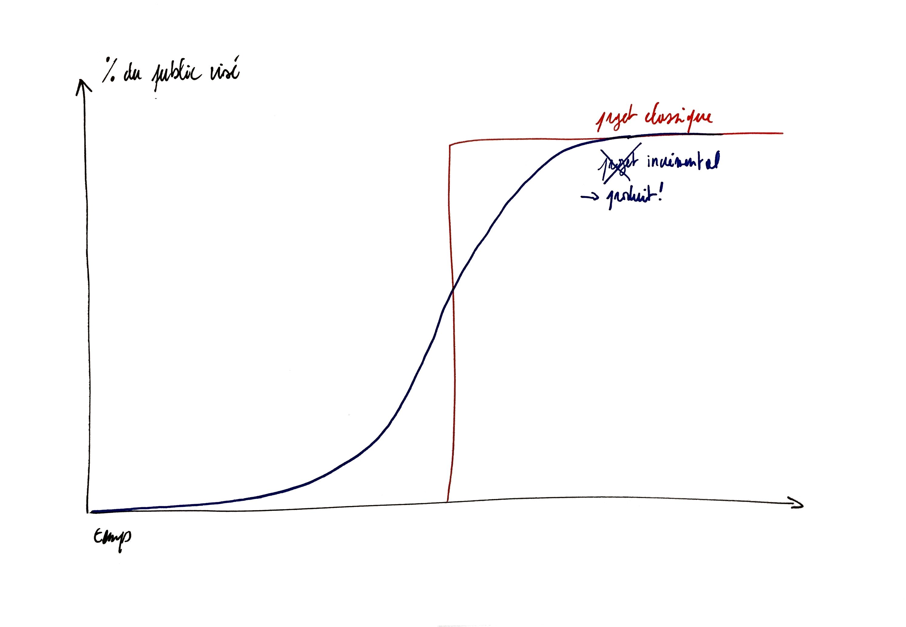
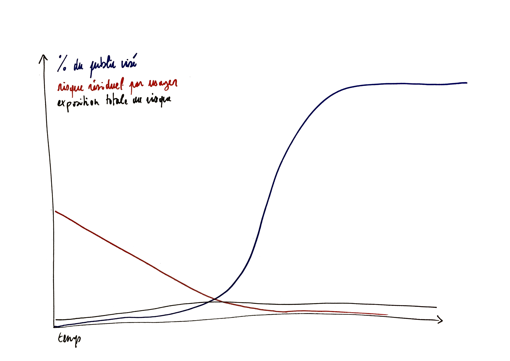

## La prise en compte incrémentale du risque: la clé de la compatibilité _agile_

Dans une démarche sécuritaire classique, l'équipe définit les besoins de sécurité d’un produit donné et les façons d'y répondre dès la phase de conception du projet, les mesures de sécurité étant très souvent définies et mises en œuvre pour le produit final et son cas d’usage à la cible. Dans une démarche agile, l’équipe cherche à livrer très tôt de la valeur à un public donné tout en cherchant à susciter l'adhésion d’autres publics.

Voici, illustrées, deux conceptions opposées de ce que devrait être la courbe de diffusion d’un produit.

Pour une équipe dont l'objectif est de livrer rapidement de la valeur à ses utilisateurs, une évaluation pertinente du risque est donc obtenue en multipliant le nombre d’usagers par le risque encouru par chaque usager, pour déterminer une exposition totale réelle au risque d’attaques numériques.

Ainsi la prise en compte des enjeux de sécurité par une équipe agile est continue — tout au long de la construction et de l'amélioration du service — et « pragmatique[^1] » — elle priorise les efforts en fonction du risque réel et assume l’existence de risques résiduels. Ce principe de management de la sécurité numérique par les risques est celui qui guide la démarche proposée. 

La façon de traiter la question de la sécurité numérique est donc très différente. La figure ci-dessous superpose à la courbe de diffusion une courbe hypothétique représentant le risque résiduel auquel un seul usager serait exposé. Initialement, le risque est substantiel mais avec une poignée d'utilisateurs il reste globalement acceptable; par contre, lorsque le produit devient un succès, l'équipe devra traiter plus agressivement les risques résiduels.L’important est donc de s’assurer qu’on arrive au point d’inflexion en ayant couvert les risques numériques les plus importants et non pas de traiter “tous les risques” en amont. Consentir un travail conséquent en sécurité numérique en amont de ce point est  doublement improductif. On aura dépensé des ressources qui auraient pu être investies dans une meilleure compréhension du besoin, alors que le gain réel en termes de sécurité sera resté très marginal.

[^1]: Le terme n’est pas exactement celui qui convient, nous avons en tête quelque chose comme « [satisficing](https://fr.wikipedia.org/wiki/Satisficing) » mais il n’a pas d’équivalent français

