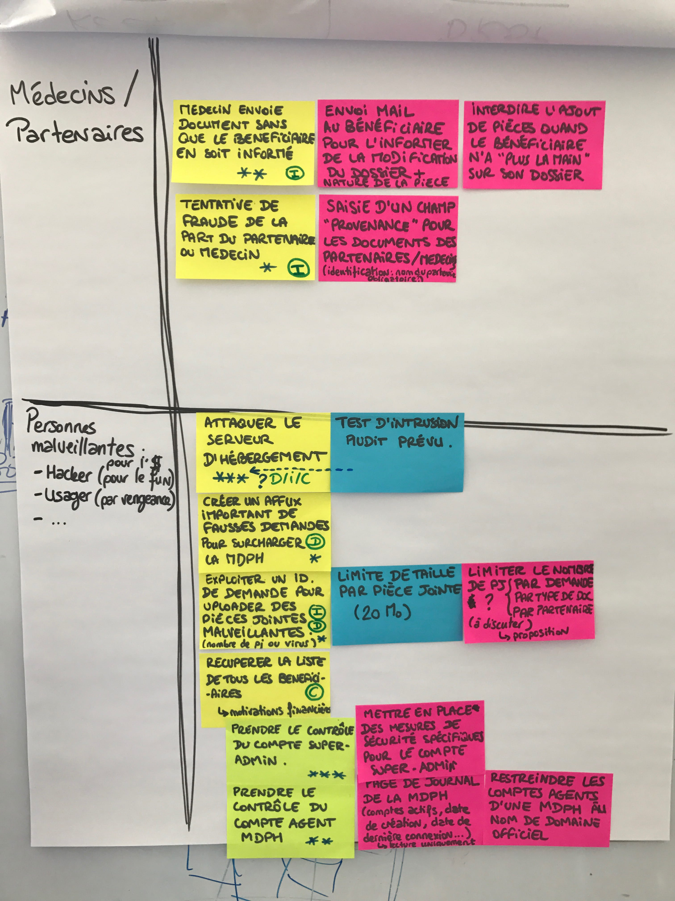
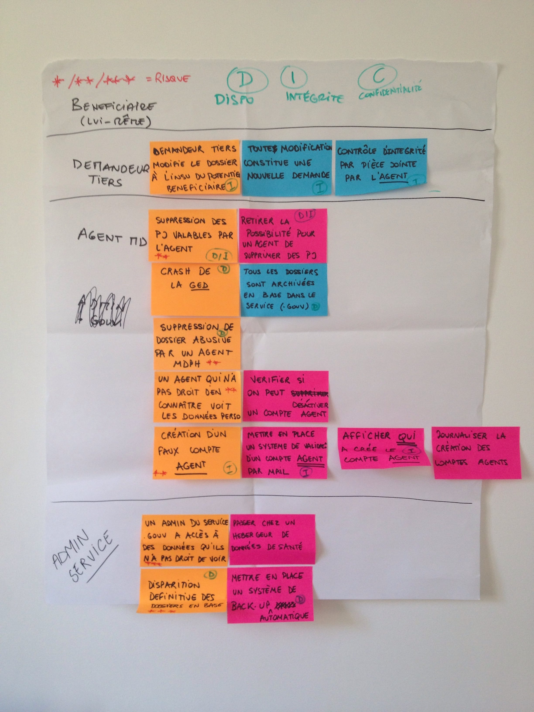

## L'atelier d'analyse des risques: le coeur de la démarche

Nos recommandations concrètes envers les équipes agiles peuvent se résumer ainsi : **l'équipe se réunit à intervalles réguliers et munie d’outils, pour discuter des risques numériques qui peuvent impacter les usagers de son service ou produit et décider de la meilleure manière de traiter ces risques**. Le moteur de la prise en compte des risques prend la forme d’un atelier organisé à intervalles réguliers au cours duquel l’équipe discute des risques numériques encourus par les usagers d’un service ou d’un produit donné en vue de déterminer la manière la plus appropriée de les traiter.

Pour les équipes agiles, un atelier type d’analyse de risque se déroule dans les conditions suivantes :

* présence de toute l'équipe et seulement l'équipe ;
* durée fixe et limitée (une à trois heures), mieux vaut privilégier la programmation de plusieurs ateliers.

Le support d’animation de l’atelier peut reposer sur l’utilisation d’un *paper board* ou de *post-its* pour accompagner la discussion et animer les éléments d’analyse de risque qui auront été consignés sur des feuillets.

### Quand faut-il tenir ces ateliers ?

Il n’est jamais trop tard pour parler de sécurité numérique et évaluer les risques inhérents à la conduite d’un projet donné, idéalement avant même le début des travaux de réalisation, voire d’investigation. Néanmoins, le fait que l'équipe ait déjà réalisé un ou plusieurs incréments de fonctionnalité, voire que son produit soit déjà accessible à de premiers usagers, ne saurait constituer une raison valable de ne pas se livrer à l'exercice.

### Comment animer l'atelier ?

Les conditions du succès d’un atelier d'analyse de risque sont à rapprocher de celles d'autres « rituels » agiles, comme par exemple la rétrospective. Véritable facilitateur, l'animateur de ces ateliers assume un rôle  particulièrement important dont voici quelques-unes des principales responsabilités :

* répartition équilibrée de la prise de parole ;
* cadrage et modération des échanges ;
* maintien d’un climat de bienveillance ;
* respect du temps : un bon atelier ne déborde pas (trop) du temps imparti.

Une animation efficace suppose donc de bien maîtriser le canevas d'analyse de risque ; celui-ci est présenté schématiquement ci-après (section « Notion de risques : les bases à connaître et à transmettre ») et de façon plus détaillée et analytique en fiche mémo.

### Faut-il se faire accompagner ?

La présence d'un·e expert·e en sécurité des systèmes d'information \(SSI\) n'est pas indispensable pour la réussite de la démarche. Quelles que soient les conclusions de l'analyse des risques, c'est à l'équipe dans son ensemble qu'il incombera de les mettre en oeuvre — c'est une conséquence de notre définition d'une équipe « agile ». Les personnes pertinentes pour cet atelier sont donc les membres de l'équipe et eux seuls.

Notez bien en particulier qu'un atelier de travail n'est pas une réunion ; l'efficacité d'un atelier est conditionnée par une prise de parole et d'initiative à peu près équilibrée entre les différents participants, elle risque d'être diminuée par la présence d'observateurs, et a fortiori si des personnes qui n'ont pas de responsabilité pour la réalisation du produit y prennent une part active.

Pour autant, il est également vrai que le niveau de maturité et de compétence au sein de l'équipe en matière de sécurité numérique pèsera de façon déterminante sur les résultats de la démarche. Si l'équipe ne maîtrise pas suffisamment ces compétences au démarrage, il lui faudra donc les acquérir. La présence d'un·e expert·e SSI, dans une posture de service et d'accompagnement, peut donc être un facteur de réussite. Il ou elle pourra jouer un rôle d'animation ou de facilitation, mais également injecter son expertise à des moments opportuns.

