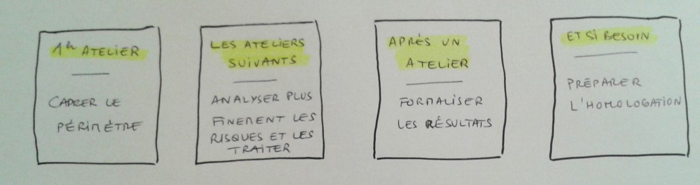

## Le premier atelier

En amont du premier atelier voire en début de séance, il est important de définir le périmètre de l’analyse : 
- Interne > ce qui engage la responsabilité de l’équipe et de sa hiérarchie ; 
- Hors périmètre > ce qui relève éventuellement d’autres acteurs.

Pour lancer ce premier atelier, vous pouvez proposer le cadrage suivant : 

> Un mois après le lancement du produit, vous découvrez avec horreur un article dans la presse nationale qui fait état d’une énorme faille de sécurité exploitée avec succès. Quels scénarios de menaces possibles vous viennent à l’esprit ? 

**Cet exercice permettra de concentrer l’attention des participants sur les enjeux et besoins de sécurité les plus importants tout en amorçant la discussion.** Lorsque celle-ci cesse de faire émerger de nouvelles idées, proposez aux participants de formaliser ce qui ressort de l’atelier en consultant la section suivante.

N'hésitez pas à ordonnancer dès ce premier atelier les grandes étapes qui guideront votre démarche de sécurité numérique. Si celle-ci s'inscrit dans une homologation de sécurité, consultez la section « Se préparer à une démarche d'homologation ».

### Un exemple suivi pas à pas: Le.Taxi

Afin d'illustrer concrètement la démarche proposée, nous avons choisi de rendre compte du premier cas réel dans lequel elle a été utilisée. Il s'agit de la plateforme nationale Le.Taxi dont la mission est d’informer sur la disponibilité et la géolocalisation des véhicules des opérateurs de taxi participants.

*Pour ce système d'information, nous avons souhaité retracer dans ce guide l'ensemble de la démarche, du premier atelier à la constitution du dossier d’homologation. L'analyse de risque complète est disponible en fiche mémo et les exemples à suivre sont issus de ces ateliers et de leurs livrables.*

## Ressources utiles

- référentiels réglementaires et normatifs applicables
- guides d'hygiène informatique
- bases de connaissances susceptibles de guider l'analyse de risque
- stratégie d'homologation visée
