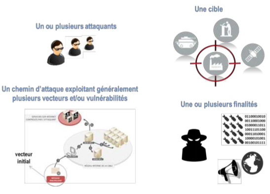
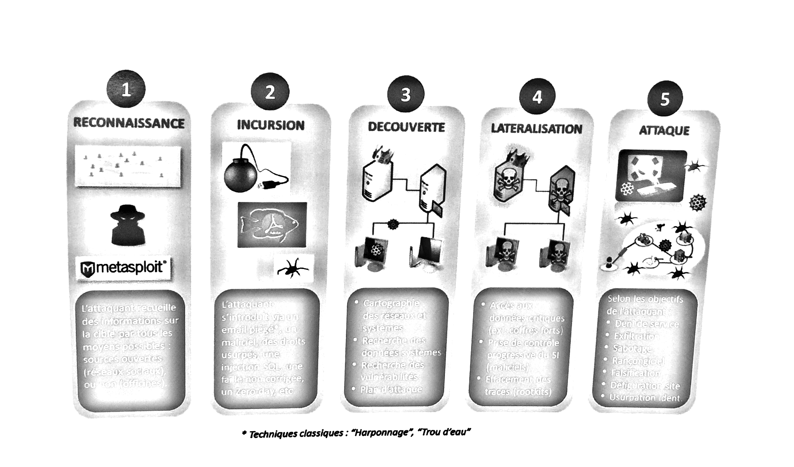
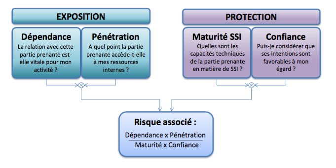

# Les clés pour identifier vos risques numériques dimensionnants

Les activités de sécurité visent à identifier les scénarios de risques dimensionnants et les mesures de sécurité associées permettant de traiter ces risques. L’objectif est d’atteindre un niveau de sécurité correspondant aux enjeux et besoins sécuritaires. En démarche Agile, un scénario de risque est décrit sous la forme d’un « abuser story » de nature intentionnelle, ou un scénario d'origine accidentelle. Cette fiche mémo présente les éléments méthodologiques importants à considérer dans l’analyse de risque.

**Un exemple pour articuler les notions de user story, abuser story, scénario accidentel :**

* user story : « en tant qu’utilisateur, je réserve en ligne mon billet de spectacle ».

* abuser story \(intentionnel\) : « En tant qu’hacktiviste, j’empêche les clients de réserver en ligne leur billet de spectacle en saturant le serveur applicatif par une attaque en déni de service. Ceci conduit à un impact préjudiciable sur l’image et la crédibilité du gestionnaire du service, voire une perte de clients ».

* scénario accidentel : « Le service de réservation en ligne est rendu indisponible suite à  
  une erreur de mise à jour du serveur applicatif par le prestataire de maintenance. Ceci conduit à un impact préjudiciable sur l’image et la crédibilité du gestionnaire du service, voire une perte de clients ».

\(Dans la pratique, on pourra utiliser quasiment le même format pour abuser stories et scénarios accidentels.\)

## Se concentrer sur les risques numériques dimensionnants

L’analyse de risque doit s’attacher à identifier les abuser stories dimensionnantes, c’est-à-dire significatives en terme d’impact et qui relèvent de menaces – intentionnelles ou accidentelles – non traitées par les mesures d'hygiène ou règlementaires. Ces abuser stories permettent à elles seuls de structurer la politique de sécurité du produit : en terme de volumétrie, l’identification et le traitement de 5 à 10 abuser stories constituent une première base qui nous paraît suffisante pour définir les mesures de sécurité structurantes liées aux cas d'usage typiques du produit.

L’analyse de risque n’a pas vocation à re-identifier des mesures de traitement connues ou imposées, qui relèvent respectivement de l’hygiène informatique et de la réglementation, et qui sont considérées comme nativement intégrées dans la politique de sécurité du produit \(voir fiche mémo précédente\).

Par contre, elle a vocation à

* valider \(ou non\) les dérogations éventuelles à ce socle de sécurité,
* identifier le besoin de durcir ce socle,
* identifier des mesures complémentaires ad hoc liées au contexte d’emploi du produit, à ses processus métier, à son écosystème, etc.

## Privilégier les abuser stories \(scénarios intentionnels\)

Parmi les scénarios de risque à prendre en compte dans une analyse de risque, ceux de nature intentionnelle peuvent être particulièrement redoutables lorsque l’attaque est menée avec une volonté délibérément forte d’atteindre un objectif visé avec des moyens engagés qui peuvent être importants. Les éléments constitutifs classiques à prendre en compte dans un abuser story intentionnel sont les suivants :

Une attaque réussie sur un système d'information ne relève que rarement de l'exploitation d'une faille unique ; les attaques intentionnelles suivent le plus souvent une séquence \(appelée cyber kill chain\) exploitant plusieurs vulnérabilités de façon coordonnée. C'est en raison de ce type de séquence que des failles d'apparence anodines peuvent entraîner des effets importants. Nous vous recommandons d'intégrer une vision globale des séquences d'attaques possibles dans vos ateliers de sécurité, afin de ne pas minorer par erreur un scénario dont la vraisemblance et l'impact pourraient être en fait disproportionnés.

Plusieurs modèles de cyber kill chain existent et peuvent être utilisés \(exemple : Lockheed Martin\). L’équipe pourra exploiter le modèle suivant, donné à titre d’information. Cette approche doit permettre d’identifier facilement les composants critiques susceptibles de servir de vecteurs d’entrée, de relais de propagation, de vecteurs d’exploitation, etc. Ces composants – de nature technique, humaine ou organisationnelle – feront alors l’objet de mesures ad hoc ou de durcissement du socle existant.

## Considérer l’écosystème comme une source de risque potentiel

L’écosystème constitue l’ensemble des parties prenantes qui gravitent autour du produit ou qui sont nécessaires à son fonctionnement. De plus en plus de modes opératoires d’attaques exploitent les éléments vulnérables d’un écosystème pour atteindre leur cible. \(On a ainsi vu un casino aux Etats-Unis victime d'une attaque par le biais… [d'un aquarium connecté à Internet](https://www.washingtonpost.com/news/innovations/wp/2017/07/21/how-a-fish-tank-helped-hack-a-casino/).\) L’analyse de risque doit alors prendre en compte ces éléments de l’écosystème, susceptibles de rendre possibles ou de faciliter des _abuser stories_ \(ex : injection d’un code malveillant par rebond via un partenaire tiers connecté, attaque en déni de service sur le fournisseur de service en nuage, piégeage de la chaîne logistique d’approvisionnement des postes et serveurs d’administration d'un réseau facilitant l'exfiltration de données sensibles\).

La sélection des parties prenantes potentiellement critiques d’un écosystème, à prendre en compte dans l’analyse de risque, peut se baser sur l’évaluation des critères suivants, chaque critère étant évalué par exemple sur une échelle de 1 à 4. Les critères d’exposition tendent à accroître le risque alors que ceux relatifs à la protection l’atténue. Les parties prenantes les plus critiques sont ensuite sélectionnées en prenant celles qui totalisent les scores les plus élevés.

L’identification des scénarios de risques, particulièrement ceux qui sont intentionnels, nécessite une certaine expertise en cybersécurité. Ceci est d’autant plus vrai pour les cas d’attaques sophistiquées, mettant en œuvre un séquencement planifié de modes d’actions sur plusieurs composants – techniques et humains généralement – du produit et de son écosystème. Comme nous l'avons précisé plus haut, l'accompagnement de l'équipe par un expert dans ce domaine peut donc être un facteur favorable à la réussite de l'atelier, en proportion avec le degré de complexité du produit et de l'écosystème.

