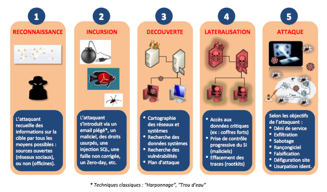

# Les clés pour identifier les risques numériques critiques

Les activités de sécurité visent à identifier les scénarios de risques critiques et les mesures de sécurité permettant de les traiter. L’objectif est d’atteindre un niveau de sécurité correspondant aux enjeux et besoins sécuritaires dans une démarche agile, un scénario de risque est décrit sous forme d’une *abuser story* de nature intentionnelle, ou d’un scénario d’origine accidentelle. Cette fiche mémo recense les aspects méthodologiques à considérer en priorité lors des ateliers d’analyse de risque.

***User story, abuser story* et scénario accidentel :**

* **User story** : *« En tant qu’utilisateur, je réserve en ligne mon billet de spectacle ».*

* **Abuser story** \(scénario intentionnel\) : *« En tant qu’hacktiviste, j’empêche les clients de réserver en ligne leur billet de spectacle en saturant le serveur applicatif par une attaque en déni de service. Ceci conduit à un impact préjudiciable sur l’image et la crédibilité du gestionnaire du service, voire une perte de clients ».*

* **Scénario accidentel** : *« Le service de réservation en ligne est rendu indisponible en raison d'une erreur de mise à jour du serveur applicatif par le prestataire en charge de la maintenance du système. Ceci conduit à un impact préjudiciable sur l’image et la crédibilité du gestionnaire du service, voire une perte de clients ».*

## Se concentrer sur les risques numériques liés aux cas d'usage du produit

L’analyse de risque doit s’attacher à identifier les abuser stories spécifiques, c’est-à-dire significatives en termes d’impact et qui relèvent de menaces – intentionnelles ou accidentelles – non couvertes par les mesures d’hygiène informatiques ou règlementaires. Ces *abuser stories* permettent de compléter, d’orienter et de consolider la politique de sécurité du produit ou du service.

En termes de volumétrie, l’identification et le traitement de 5 à 10 *abuser stories* constituent une première base solide pour définir les mesures de sécurité structurantes liées aux cas d’usage typiques du produit.

L’analyse de risque n’a pas vocation à identifier de nouvelles mesures de traitement connues ou imposées, qui relèvent respectivement de l’hygiène informatique et de la réglementation, et qui sont considérées comme nativement intégrées dans la politique de sécurité du produit (voir fiche mémo). En revanche, elle a vocation à :

* valider ou non les dérogations éventuelles à ce socle de sécurité ;
* identifier le besoin de durcir ce socle ;
* identifier des mesures complémentaires ad hoc liées aux conditions d’emploi du produit, à ses processus métier, à son écosystème, etc.

## Privilégier les *abuser stories* \(scénarios intentionnels\)

Parmi les scénarios de risques à prendre en compte dans une analyse de risque, ceux de nature intentionnelle peuvent s’avérer particulièrement redoutables lorsque l’attaque est menée avec la volonté d’atteindre l’objectif visé en engageant des moyens particulièrement importants. Les éléments constitutifs classiques à prendre en compte dans une *abuser story* intentionnelle sont les suivants :

La réussite d’une attaque sur un système d’information ne relève que rarement de l’exploitation d’une seule faille. Les attaques intentionnelles suivent le plus souvent une séquence appelée *cyber kill chain* exploitant plusieurs vulnérabilités de façon coordonnée. C’est en raison de telles séquences que des failles d’apparence anodines peuvent devenir lourdes de conséquences. Nous vous recommandons d’adopter une vision globale des séquences d’attaques possibles dans vos ateliers de sécurité, afin de ne pas minimiser à tort un scénario dont la vraisemblance et l’impact pourraient se révéler disproportionnés.

Plusieurs modèles de *cyber kill chain* existent et peuvent être utilisés \(exemple : *Lockheed Martin*\). L’équipe pourra exploiter le modèle suivant, donné à titre d’information. Cette approche doit permettre d’identifier facilement les composants critiques susceptibles de servir de vecteurs d’entrée ou d’exploitation, de relais de propagation, etc. Ces composants – de nature technique, humaine ou organisationnelle – feront alors l’objet de mesures ad hoc ou d’un durcissement du socle existant.

## Considérer l’écosystème comme une source de risque potentiel

On entend par écosystème l’ensemble des parties prenantes qui gravitent à son fonctionnement. Un nombre croissant de modes opératoires d’attaques exploite les vulnérabilités d’un écosystème pour atteindre leur cible. C’est ainsi qu’aux États-Unis, un casino a fait les frais d’une attaque menée par le biais… [d’un aquarium connecté !](https://www.washingtonpost.com/news/innovations/wp/2017/07/21/how-a-fish-tank-helped-hack-a-casino/) L’analyse de risque doit alors prendre en compte ces éléments de l’écosystème, susceptibles de rendre possibles ou de faciliter la réalisation *d’abuser stories*.

> Exemple
>
> Injection de code malveillant par rebond par le biais d’un partenaire tiers connecté ; attaque en déni de service sur le fournisseur de service en nuage ; piégeage de la chaîne logistique d’approvisionnement des postes et serveurs d’administration d’un réseau facilitant l’exfiltration de données sensibles ; etc.).

Les parties prenantes critiques d’un écosystème, à prendre en compte dans l’analyse de risque, peuvent par exemple être identifiées en vous posant les questions suivantes :
* La relation avec cette partie prenante est-elle essentielle pour mon activité ? Suis-je dépendant de services ou de bases de données hébergés ou exploités par la partie prenante ?
* Jusqu’à quel point la partie prenante accède-t-elle à mes ressources internes (mes locaux, mes réseaux informatiques, mon organisation) ?
* Ses services et réseaux informatiques sont-ils exposés sur Internet ? Sont-ils suffisamment sécurisés ?
* Puis-je considérer que ses intentions sont favorables à mon égard ?

Une méthode simple et pragmatique d’évaluation de la menace d’un écosystème est proposée dans le guide « EBIOS » de l’ANSSI.

L’identification des scénarios de risque, particulièrement ceux de nature intentionnelle, nécessite une certaine expertise en sécurité numérique. Un constat d’autant plus vrai pour les cas d’attaques sophistiquées, mettant en œuvre un séquencement planifié de modes d’actions sur plusieurs composants – techniques et humains généralement – du produit et de son écosystème. Comme nous l’avons précisé plus haut, l’accompagnement de l’équipe par un expert dans ce domaine peut donc être un atout pour la réussite de l’atelier, en proportion avec le degré de complexité du produit et de l’écosystème.
