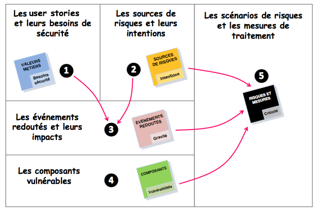
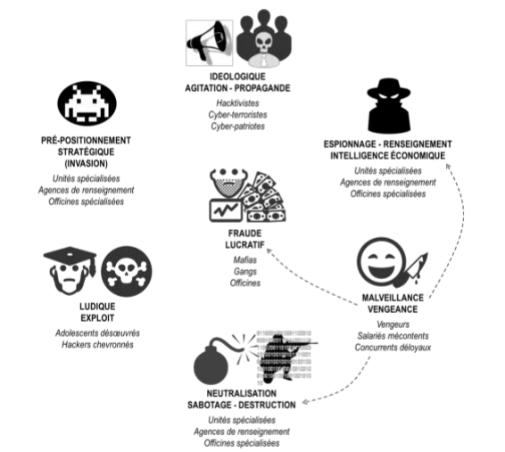

# Le canevas de l'analyse des risques

L'articulation entre les éléments de l'analyse des risques est résumée par le schéma suivant :

\(1\) **Les user stories et leurs besoins de sécurité**

Pour cette rubrique, il s’agit de recenser les principaux éléments de valeur d'usage mis en œuvre par le produit, et à estimer leurs besoins de sécurité \(DICP : disponibilité, intégrité, confidentialité, preuve\). Ces éléments seront généralement exprimés sous la forme de _user stories_.

L’objectif est d’identifier pour chaque _user story_ quels besoins de sécurité sont importants, afin d’orienter par la suite le travail d’identification des scénarios de risques pertinents. Le degré d’importance peut être pondéré par un indice simple, par exemple : **•• besoin important, • besoin notable**. \(En cas de divergences parmi les participants, on peut procéder à un exercice de type « [dot vote](https://en.wikipedia.org/wiki/Dot-voting) ».\) Un schéma similaire pourra être adopté pour les autres éléments de l'analyse.

Le point de départ de l’atelier – les_ user stories_ – est important. En commençant par là, l’équipe ancre le reste de l’atelier dans l’idée que les mesures de sécurité servent à assurer la valeur livrée aux usagers. En effet, pour chaque besoin de sécurité important d’une valeur métier, il y a un ou plusieurs événements redoutés et au moins un scénario de risque susceptible de compromettre la proposition de valeur.

Exemples : _un client peut émettre une demande \(héler virtuellementun taxi\), un client peut évaluer une course effectuée ou déclarer un incident_.

\(2\) **Les sources de risques**

Il s’agit de recenser les sources de risques – accidentelles ou intentionnelles, externes ou internes – susceptibles d’impacter la valeur métier : _qui ou quoi pourrait porter atteinte aux besoins de sécurité_. Le schéma ci-dessous résume visuellement ce qui peut motiver des attaques intentionnelles, et peut fournir un bon point de départ à la discussion lors de l’atelier.

Il est recommandé de recenser des sources de risques de natures \(accidentelle, intentionnelle, interne, externe\) et de motivations variées afin de disposer de quelques sources de risques représentatives permettant de bâtir ensuite des scénarios de risques avec des angles de menaces et des modes opératoires différents.

Exemples : _opérateur concurrent cherchant à discréditer, voire saboter le service Le.Taxi \(malveillance\), mafia cherchant à collecter des données à caractère personnel pour les monnayer \(lucratif\)_.

\(3\) **Les événements redoutés et leur gravité**

Un événement redouté \(ER\) correspond au non-respect d’un besoin de sécurité : chaque besoin de sécurité associé à une _user story_ de l'étape \(1\) est donc décliné sous la forme d’un ou plusieurs événements redoutés. On précisera bien le ou les impacts \(sur les missions, sur la sécurité des personnes, financiers, juridiques, sur l'image, sur l'environnement, sur les tiers, etc.\) ainsi que le niveau de gravité estimé. L’objectif étant d’identifier en priorité les événements redoutés qui conduisent à des impacts difficiles à surmonter, l'échelle de cotation peut en première approche se réduire à un indice de priorité, par exemple : P1 – ER à retenir, P2 – ER à considérer dans un second temps. De façon plus élaborée, une échelle de cotation à 3 niveaux ou plus pourra être adoptée : **•** gravité faible, **••** moyenne, **•••** élevée.

Afin de faire le lien à ce stade avec les sources de risques identifiées dans l’étape \(2\), il peut être pertinent de mentionner les sources de risques les plus vraisemblables susceptibles d’en être à l’origine. Enfin, dans un souci d’efficacité, l’équipe s’intéresse en première approche aux événements redoutés associés aux besoins de sécurité « importants ».

Exemple :_ un opérateur concurrent, se faisant passer pour un faux client, hèle un taxi qui fait une course d’approche en pure perte._

\(4\) **Les composants vulnérables**

Il s’agit d’identifier les composants du produit qui contribuent à la réalisation des _user stories_ identifiées dans l’étape \(1\) et susceptibles d’être concernés ou ciblés par les sources de risques de l’étape \(2\). Il est recommandé de préciser pour chaque composant ses vulnérabilités potentielles que des sources de risque seraient susceptibles d’exploiter.

Exemple : _base de données Le.Taxi \(accès en lecture/écriture depuis Internet, modification fréquente\)_.

L’identification des composants peut être structurée comme suit :

* Physique : locaux, infrastructures, espaces physiques supports pour l'activité et pour les échanges de flux 
* Organisations : structures organisationnelles, processus métiers et supports, ressources humaines
* Systèmes numériques matériels et logiciels : systèmes informatiques et de téléphonie, réseaux de \(télé\)-communication.

Le degré de granularité dans la description des composants sera adapté au niveau de connaissance du produit lors de l’atelier. Enfin, les composants prioritaires à recenser sont ceux qui contribuent \(de façon directe ou indirecte\) aux _user stories_ ayant des besoins de sécurité "importants".

\(5\) **Les scénarios de risques \(**_**abuser stories**_**\) et les mesures de traitement**

La finalité de l’atelier est d’identifier les risques numériques dimensionnants à prendre en compte pour bâtir ou compléter la politique de sécurité du produit.

* Dans l’étape \(5\), l’équipe commence par dresser une liste de **scénarios de risques** – les _abuser stories_ – en confrontant les sources de risques \(2\), les événements redoutés \(3\) et les composants vulnérables \(4\). Concrètement, il s’agit de voir de quelle façon chaque source de risque retenue peut impacter des composants du produit, par exploitation notamment de leurs vulnérabilités ou d’un facteur externe aggravant, pour générer un événement redouté. Chaque abuser story peut être classiquement évalué en terme de _vraisemblance_, puis de _criticité _à partir de la \_gravité \_de l'événement redouté associé.

Exemples :  _un attaquant externe accède aux informations à caractère personnel des clients en usurpant l'identité du serveur Le.Taxi ou en exploitant une vulnérabilité non corrigée, un client de mauvaise foi attribue abusivement une mauvaise note au taxi._

* Puis, pour chaque _abuser story_ répertorié, l’équipe définit l’**option de traitement du risque** la plus appropriée \(éviter, réduire, transférer, accepter\). Dans le cas où le risque doit être réduit, les participants définissent les mesures de sécurité complémentaires qu'il faudra mettre en œuvre, en plus des mesures existantes ou déjà prévues. Leur réalisation est priorisée par l’équipe au même titre que les autres _user stories_.

* Enfin, l'équipe termine l'atelier en identifiant les **risques résiduels**. Ces derniers concernent :

  * les besoins de sécurité de l'étape \(1\) et les événements redoutés de l'étape \(3\) non déclinés en _abuser stories_ ;

  * les _abuser stories_ non traitées \(acceptées en l'état\) ou seulement partiellement \(mesures de sécurité mises en place, mais ne réduisant pas complètement ou suffisamment le risque\).

  * les _abuser stories_ faisant l'objet d'un transfert du risque, lequel ne couvre généralement pas l'ensemble des impacts \(exemple : l'assurance ne couvre pas l'atteinte à l'image\).

Un certain travail \(souvent subjectif\) de consolidation des risques résiduels est à effectuer par l'équipe afin de disposer d'un bilan à jour et reflétant l'état de maîtrise du risque numérique du produit. Les risques résiduels les plus significatifs seront en priorité recensés et mis en évidence \(l'usage d'échelles de cotation en gravité, vraisemblance et criticité, associé à des seuils d'acception du risque, constituera une aide précieuse pour hiérarchiser les risques résiduels avec une certaine objectivité et cohérence d'ensemble\). Notons enfin que ce bilan, enrichi au fil des ateliers d'analyse de risques, sera complété des éventuelles vulnérabilités résiduelles issues des audits de sécurité \(audit de configuration, de code, test d'intrusion\).

La section suivante présente l'intégralité de l'analyse des risques pour la plateforme Le.Taxi et vous permettra d'observer l'articulation des différents éléments présentés ici sur un cas pratique.

