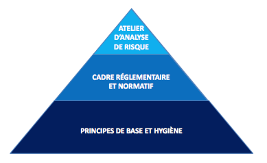

# Structurer votre politique de sécurité

La politique de sécurité d'un système d'information \(ou PSSI\) peut se structurer autour de trois niveaux de mesure de sécurité:

* les mesures d'hygiène informatique
* les mesures règlementaires et normatives
* les mesures issues de l'analyse de risque

Les **mesures d’hygiène** couvrent divers domaines : cryptographie, postes de travail et serveurs, liaisons sans fil, applications Web, réseaux, externalisation, technologies sans contact,

etc. Elles constituent un « socle de bonnes pratiques » applicables de façon systématique et conférant un niveau de protection propre à résister aux menaces courantes.

Les **mesures réglementaires et normatives** complètent ce socle d’hygiène par des exigences sectorielles applicables dans des domaines précis, selon les enjeux de sécurité \(disponibilité, intégrité, confidentialité, preuve\). Ainsi, la Loi de Programmation Militaire \(LPM\) dicte des obligations concernant les opérateurs d'importance vitale, le Référentiel Général de Sécurité \(RGS\) s'applique aux systèmes d'information de l'administration, les règlements de la CNIL et le Règlement Général de Protection des Données \(RGPD\) européen s'appliquent à tout opérateur traitant de données à caractère personnel, l’Instruction Générale Interministérielle 1300 \(IGI 1300\) définit les règles relatives à la protection du secret de la défense nationale, etc.

Les **mesures issues des ateliers d’analyse** de risque complètent le socle ci-dessus par des mesures contextuelles, spécifiques à la mise en œuvre technique et fonctionnelle du produit ou service au sein de son écosystème \(exemples : mise en place d’une liste blanche pour sécuriser un processus de traitement automatisé, durcissement d’une mesure d’hygiène, adaptation d’une mesure réglementaire\). Ces mesures permettent au produit d’être robuste et résilient à des menaces plus particulièrement ciblées et/ou sophistiquées jugées plausibles.

L'analyse de risque n'a donc pas vocation à ré-identifier des mesures de sécurité connues ou imposées, qui relèvent respectivement de l'hygiène et de la règlementation.

